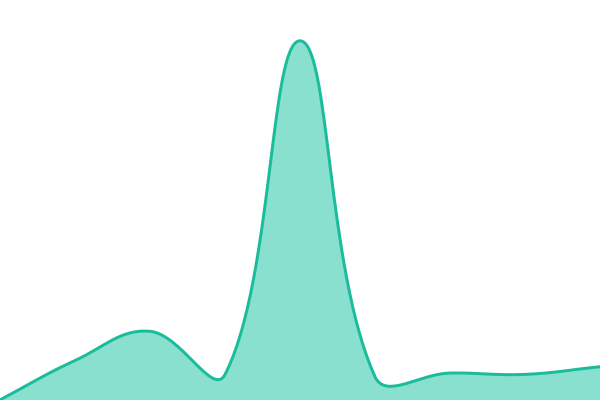

# [📈 Live Status](https://cenacrew.github.io/pfy-upptime): <!--live status--> **🟥 Complete outage**

This repository contains the open-source uptime monitor and status page for [Valentin Sourdois Pajot](www.cenacrew.com), powered by [Upptime](https://github.com/upptime/upptime).

With [Upptime](https://upptime.js.org), you can get your own unlimited and free uptime monitor and status page, powered entirely by a GitHub repository. We use [Issues](https://github.com/cenacrew/pfy-upptime/issues) as incident reports, [Actions](https://github.com/cenacrew/pfy-upptime/actions) as uptime monitors, and [Pages](https://cenacrew.github.io/pfy-upptime) for the status page.

<!--start: status pages-->
<!-- This summary is generated by Upptime (https://github.com/upptime/upptime) -->
<!-- Do not edit this manually, your changes will be overwritten -->
<!-- prettier-ignore -->
| URL | Status | History | Response Time | Uptime |
| --- | ------ | ------- | ------------- | ------ |
|  [API plateforme](https://pfy-api-m7w3i5eojq-ew.a.run.app/api/v1/health) | 🟥 Down | [api-plateforme.yml](https://github.com/cenacrew/pfy-upptime/commits/HEAD/history/api-plateforme.yml) | 

 517ms
     
 | 

<a href="https://cenacrew.github.io/pfy-upptime/history/api-plateforme">99.98%</a>
    

|  [Vitrine](https://portforyou.web.app) | 🟥 Down | [vitrine.yml](https://github.com/cenacrew/pfy-upptime/commits/HEAD/history/vitrine.yml) | 

 1334ms
     
 | 

<a href="https://cenacrew.github.io/pfy-upptime/history/vitrine">99.99%</a>
    

|  [Démo — Atelier](https://pfy-demo-atelier.web.app/api/v1/health) | 🟥 Down | [demo-atelier.yml](https://github.com/cenacrew/pfy-upptime/commits/HEAD/history/demo-atelier.yml) | 

 225ms
     
 | 

<a href="https://cenacrew.github.io/pfy-upptime/history/demo-atelier">97.02%</a>
    

|  [Démo — Monolith](https://pfy-demo-monolith.web.app/api/v1/health) | 🟥 Down | [demo-monolith.yml](https://github.com/cenacrew/pfy-upptime/commits/HEAD/history/demo-monolith.yml) | 

 227ms
     
 | 

<a href="https://cenacrew.github.io/pfy-upptime/history/demo-monolith">97.03%</a>
    

|  [Démo — Papier](https://pfy-demo-papier.web.app/api/v1/health) | 🟥 Down | [demo-papier.yml](https://github.com/cenacrew/pfy-upptime/commits/HEAD/history/demo-papier.yml) | 

 238ms
     
 | 

<a href="https://cenacrew.github.io/pfy-upptime/history/demo-papier">97.04%</a>
    

<!--end: status pages-->

[**Visit our status website →**](https://cenacrew.github.io/pfy-upptime)

## 📄 License

- Powered by: [Upptime](https://github.com/upptime/upptime)
- Code: [MIT](./LICENSE) © [Anand Chowdhary](https://anandchowdhary.com)
- Data in the `./history` directory: [Open Database License](https://opendatacommons.org/licenses/odbl/1-0/)
